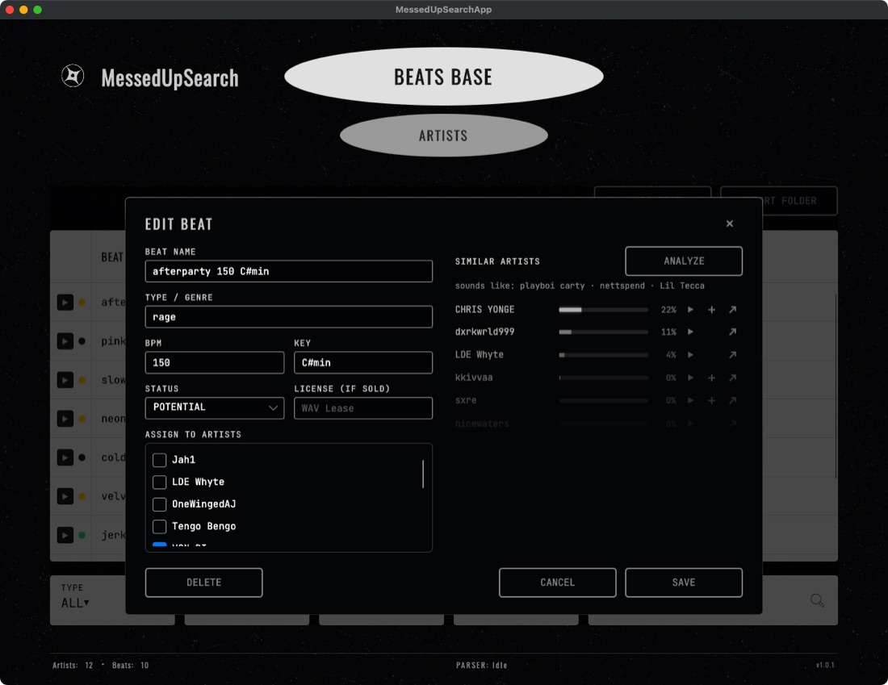
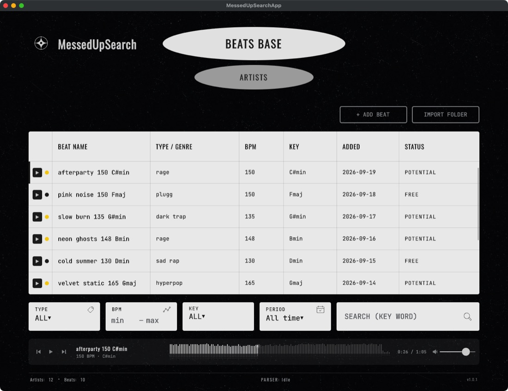
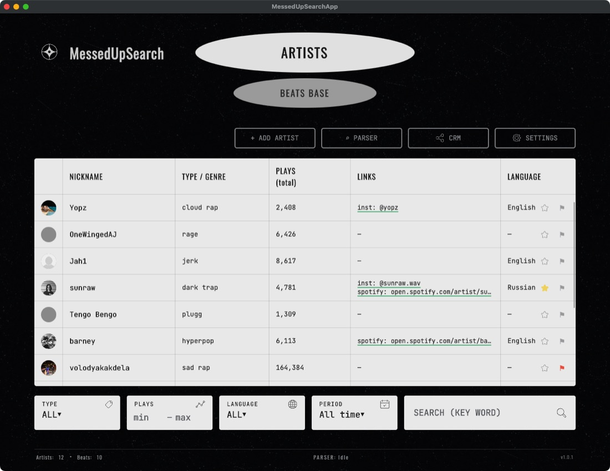
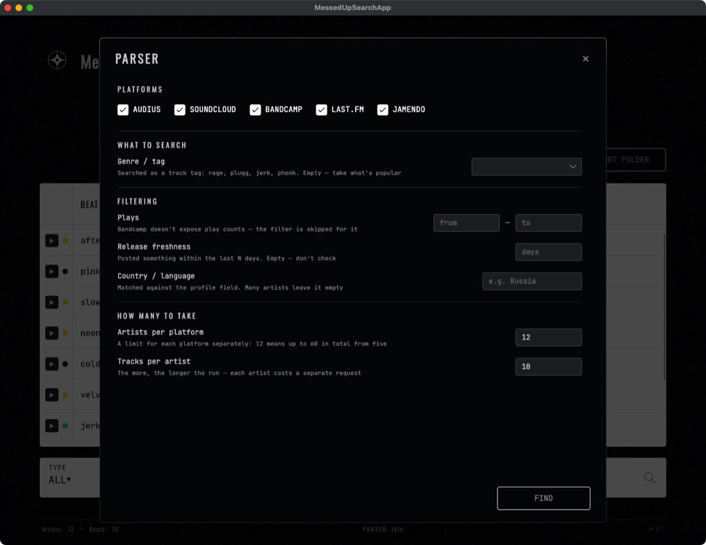
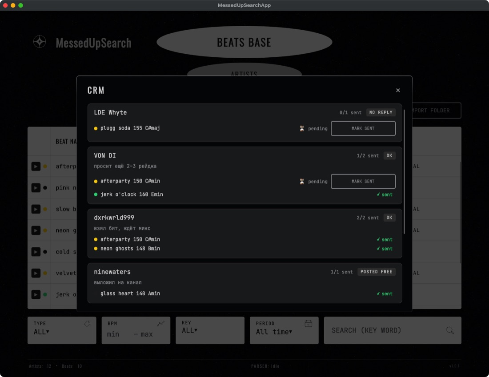
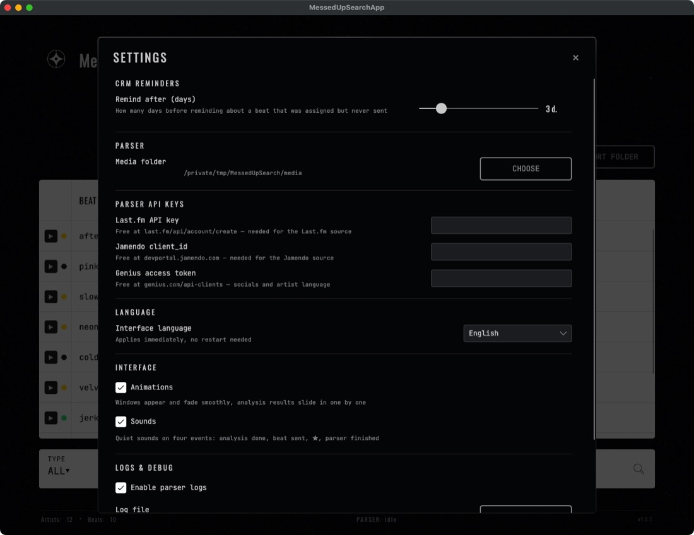

  

  <a href="README.md">Русский</a> · <b>English</b>

  
  
  
  

An app for beatmakers: all your beats in one table, a roster of underground artists, a record of who got what — and artists to pitch a beat to, picked **by how the beat sounds**.

  <a href="https://github.com/fewvar/MessedUPSearch/releases/latest/download/MessedUpSearch.app.zip"><b>Download for macOS</b></a>
  &nbsp;·&nbsp;
  <a href="https://github.com/fewvar/MessedUPSearch/releases/latest/download/MessedUpSearch-win-x64.exe"><b>Download for Windows</b></a>

---

## Who to pitch a beat to

Open a beat, hit **ANALYZE** — a second later the app shows:

- **"sounds like"** — three big artists whose style the beat resembles;
- **who to pitch** — ten underground artists (1,000 to 300,000 plays) from a base of 650+ rappers on SoundCloud and Audius. Each one has ▶ play the track of theirs that is **closest to your beat** — you hear right away why they made the list; ＋ add to your roster; ↗ open the profile to reach out.

It compares the actual sound: a neural network listens to the beat and compares it with the instrumentals of the artists' tracks (vocals are removed beforehand). No genre tags or BPM needed.

Treat it as a shortlist to listen through, not a ready mailing list: play the candidates with ▶ and pick the ones that really fit. In testing, the right artist lands in the top five of 30 big names about half the time — three times better than chance, but not magic.

Everything the analysis finds is saved: an artist's card shows which of your beats fit them.

## Beats and player

- Add beats one by one (WAV / MP3) or import a whole folder — re-importing never creates duplicates.
- Name, genre, BPM, key and status: **potential**, **free** or **sold** (with license type).
- Filter by genre, BPM, key, date and search by name — all instant. Click a column header to sort: ▼ → ▲ → back.
- Built-in player with a waveform: ▶ in the beat row, click the waveform to seek, previous / next beat, volume is remembered. Space pauses, ← / → seek.

## Artists and finding new ones

- Artist roster: avatar, nickname, genre, plays, SoundCloud / Instagram / Spotify links, language, notes.
- ★ favorite and 🚩 red flag — one click right in the table.
- The **parser** searches five platforms at once — Audius, SoundCloud, Bandcamp, Last.fm, Jamendo — by genre, play count, release freshness and country. Socials are pulled from Genius. Only the artists you tick get added.

  
  

## Who got what

- Link a beat to one or more artists right from the beat card.
- The **CRM** shows everyone you're working with: status (no reply / ok / posted free), notes, which beats were sent and which are still waiting.
- Linked a beat but never sent it? After a set number of days the app reminds you on startup.

## Small things

- Russian and English interface, switches instantly, no restart.
- Smooth animations following Apple's motion principles and a few quiet sounds (analysis done, beat sent, ★, parser finished) — both can be turned off in Settings; the system Reduce Motion setting is respected.
- All data stays on your computer. The app only goes online to search for artists, stream their tracks in the player and, once, to fetch the underground artist base.

## Install

**macOS** (Apple Silicon): download [`MessedUpSearch.app.zip`](https://github.com/fewvar/MessedUPSearch/releases/latest/download/MessedUpSearch.app.zip), unzip and drag it to Applications. On first launch: right-click → Open (the app isn't signed with an Apple certificate).

**Windows**: download [`MessedUpSearch-win-x64.exe`](https://github.com/fewvar/MessedUPSearch/releases/latest/download/MessedUpSearch-win-x64.exe) and run it. If SmartScreen warns about an unknown publisher — "More info" → "Run anyway".

The parser needs free Last.fm, Jamendo and Genius keys — the links to get them are right in Settings.

---

Sound matching uses the Discogs-EffNet model (Essentia, MTG / Universitat Pompeu Fabra), licensed CC BY-NC-SA 4.0 — non-commercial use only. Made by <a href="https://github.com/fewvar">@fewvar</a>.
