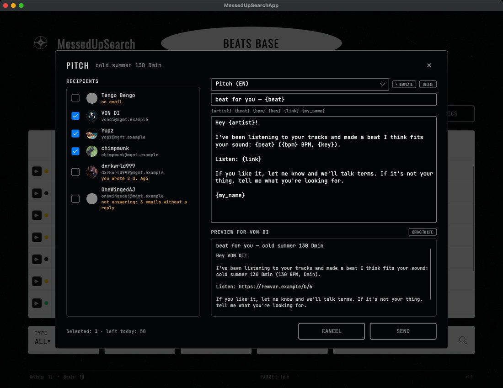
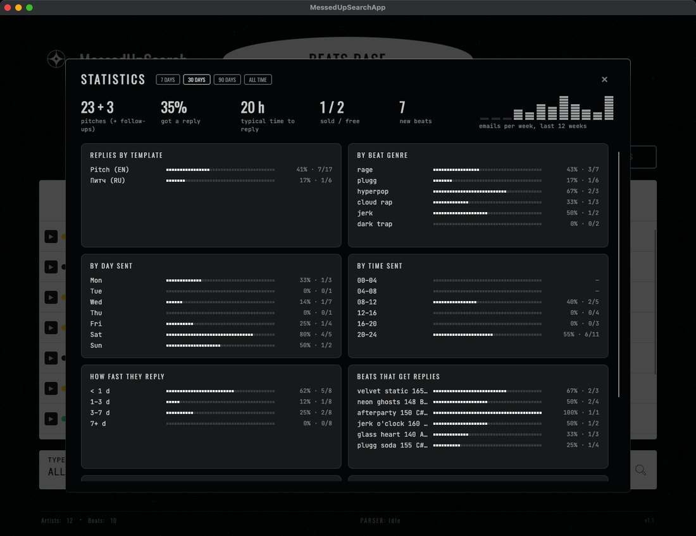
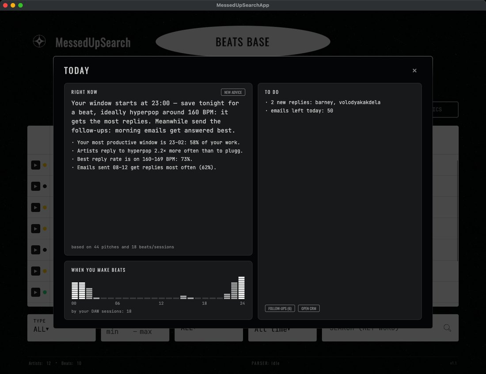

  

  <a href="README.md">Русский</a> · <b>English</b>

  
  
  
  

An app for beatmakers: all your beats in one table, a roster of underground artists, artists picked **by how the beat sounds**, pitching from your own email and a CRM that tracks replies by itself.

  <a href="https://github.com/fewvar/MessedUPSearch/releases/latest/download/MessedUpSearch.app.zip"><b>Download for macOS</b></a>
  &nbsp;·&nbsp;
  <a href="https://github.com/fewvar/MessedUPSearch/releases/latest/download/MessedUpSearch-win-x64.exe"><b>Download for Windows</b></a>

First time here? Start with <a href="#how-to-use"><b>How to use</b></a> — step by step, including where to get every key.

---

## Who to pitch a beat to

Open a beat, hit **ANALYZE** — a second later the app shows:

- **"sounds like"** — three big artists whose style the beat resembles;
- **who to pitch** — ten underground artists (1,000 to 300,000 plays) from a base of 650+ rappers on SoundCloud and Audius. Each one has ▶ play the track of theirs that is **closest to your beat** — you hear right away why they made the list; ＋ add to your roster; ↗ open the profile. Tick the ones that fit and pitch the beat to all of them at once.

It compares the actual sound: a neural network listens to the beat and compares it with the instrumentals of the artists' tracks (vocals are removed beforehand). No genre tags or BPM needed.

Treat it as a shortlist to listen through, not a ready mailing list: play the candidates with ▶ and pick the ones that really fit. In testing, the right artist lands in the top five of 30 big names about half the time — three times better than chance, but not magic.

Everything the analysis finds is saved: an artist's card shows which of your beats fit them.

## Beats and player

- Add beats one by one (WAV / MP3) or import a whole folder — re-importing never creates duplicates.
- Name, genre, BPM, key and status: **potential**, **free** or **sold** (with license type).
- Filter by genre, BPM, key, date and search by name — all instant. Click a column header to sort: ▼ → ▲ → back.
- Built-in player with a waveform: ▶ in the beat row, click the waveform to seek, previous / next beat, volume is remembered. Space pauses, ← / → seek.

## Artists and finding new ones

- Artist roster: avatar, nickname, genre, plays, SoundCloud / Instagram / Spotify links, language, notes.
- ★ favorite and 🚩 red flag — one click right in the table.
- The **parser** searches five platforms at once — Audius, SoundCloud, Bandcamp, Last.fm, Jamendo — by genre, play count, release freshness and country. Socials are pulled from Genius. Only the artists you tick get added.

  
  

## Pitching from your own email

- The artist card has email, Telegram and another contact. "Find in profile" pulls contacts from the SoundCloud and Audius description (even "name (at) gmail (dot) com") — they go into the card only when you click.
- **Pitch** a beat right from its card or from the analysis results with checkboxes. Emails go out from your own mailbox (Gmail, Yandex, Mail.ru, iCloud or any other), with a link to the beat, one every 20–40 seconds and no more than a daily limit — so your mailbox isn't flagged as spam. Pitching runs in the background, you can close the window.
- Email templates with placeholders (`{artist}`, `{beat}`, `{bpm}`, `{key}`, `{link}`, `{my_name}`) and a preview for every artist before sending.
- Spam protection: artists who already got this beat, who you wrote to less than a week ago, or who ignored three emails in a row are unticked, with the reason shown.
- **Bring to life** — AI with your own key (Groq, OpenRouter or any OpenAI-compatible server) rewrites the email for each artist: their nickname, genre, one track. It is told not to invent facts and the beat link is checked — anything that fails goes out as the template.
- The email password and the AI key live in the system keychain (Keychain / Windows Credential Manager), not in the settings file.

## A CRM that keeps itself

- Every email is logged automatically: which beat, to whom, when, which template.
- Every few minutes the app checks your inbox for artists' replies — the CRM shows "replied" and the first line. The rest of your mail is not read.
- No reply for a week (configurable) — **Follow-ups** in one click: the reminder goes into the same thread, one per beat.
- Linked a beat by hand but never sent it — the app reminds you.
- Email opens are not tracked: that needs a server of its own, and emails go straight from your mailbox.

## Statistics and "Today"

- **Statistics** for a week, a month, three months or all time: reply rate by template, beat genre, day and hour sent, how fast artists reply, which beats get replies, which artists reply (genre, plays).
- **Today** — tips for the day, strictly about beats and pitching: when you usually make beats, which genre and tempo get more replies, when to send, what's sitting unsent and who needs a follow-up. With an AI key — a two-sentence piece of advice; only these numbers are sent to it, no emails or names.
- Optional DAW session tracking (FL Studio, Ableton, Logic and others): once a minute the app checks whether a DAW is in front and keeps only intervals like "FL Studio 14:05–16:40". No window titles or project names, only on your computer, erased with one button. It's on only with your consent — together with a tray icon and launch with the system, so replies and pitching keep working with the window closed.

  
  

Screenshots use demo data: made-up emails and replies, addresses in the reserved `.example` domain.

## Small things

- Russian and English interface, switches instantly, no restart.
- Smooth animations following Apple's motion principles and a few quiet sounds (analysis done, beat sent, ★, parser finished) — both can be turned off in Settings; the system Reduce Motion setting is respected.
- All data stays on your computer. The app only goes online to search for artists, stream their tracks in the player, once to fetch the underground artist base — and to your mailbox and the AI, if you connect them.
- "Report a problem" in Settings drafts an email with the version and the log tail — you send it yourself from your mail app.

## Install

**macOS** (Apple Silicon): download [`MessedUpSearch.app.zip`](https://github.com/fewvar/MessedUPSearch/releases/latest/download/MessedUpSearch.app.zip), unzip and drag it to Applications. On first launch: right-click → Open (the app isn't signed with an Apple certificate).

**Windows**: download [`MessedUpSearch-win-x64.exe`](https://github.com/fewvar/MessedUPSearch/releases/latest/download/MessedUpSearch-win-x64.exe) and run it. If SmartScreen warns about an unknown publisher — "More info" → "Run anyway".

Then go through [How to use](#how-to-use): the first steps, and where to get the free keys for the parser, the email app password and the AI key.

## How to use

Step by step, from scratch. Only steps 1 and 2 are required; connect the rest when you need it. Keys and passwords only unlock their own features — without them the app works, that part is just unavailable.

| What you want | What it needs |
| :--- | :--- |
| Keep beats, listen, match artists by sound | nothing — works out of the box |
| Find new artists with the parser | nothing for Audius, SoundCloud, Bandcamp; keys for Last.fm and Jamendo, a Genius token for socials |
| Pitch beats by email | an app password for your mailbox |
| "Bring to life" emails and advice in "Today" | an AI key (Groq or OpenRouter — free) |

### 1. First launch

The app asks whether it may track DAW sessions. It's optional: "Not now" breaks nothing, "Today" then uses your beat file times. You can change your mind in **Settings → "Today and DAW sessions"**.

Interface language — **Settings → Language**. Settings open with the **SETTINGS** button on the **ARTISTS** tab.

### 2. Add beats

**BEATS BASE** tab → **+ ADD BEAT** (one WAV / MP3) or **IMPORT FOLDER** (every WAV and MP3 in a folder; importing again never creates duplicates). Click a row to open the beat card: name, genre, BPM, key, status.

### 3. Match artists by sound

In the beat card → **ANALYZE**. The first time the app downloads the underground artist base (about 7 MB); after that it's a second or two per beat. In the results: **▶** plays the artist's track closest to your beat, **＋** adds the artist to your roster, **↗** opens their profile. Tick the ones that fit — you can pitch to them right away (step 6).

### 4. Find new artists with the parser

**ARTISTS** tab → **⌕ PARSER**: pick platforms, genre, play range and release freshness → **FIND** → tick who you want → **ADD … TO DATABASE**.

Audius, SoundCloud and Bandcamp need no keys. Last.fm and Jamendo need free keys, and a Genius token pulls in socials and the artist's language. All three go into **Settings → Parser API keys**.

<b>Last.fm API key</b>

1. Sign in or sign up at [last.fm](https://www.last.fm).
2. Open [last.fm/api/account/create](https://www.last.fm/api/account/create), enter any application name (e.g. `MessedUpSearch`) and a short description; other fields can stay empty.
3. The next page shows the **API key** — copy it (the shared secret isn't needed) into "Last.fm API key".

<b>Jamendo client_id</b>

1. Sign up at [devportal.jamendo.com](https://devportal.jamendo.com).
2. Create an application (any name).
3. Copy its **Client ID** into "Jamendo client_id".

<b>Genius access token</b>

1. Sign in at [genius.com](https://genius.com) and open [genius.com/api-clients](https://genius.com/api-clients).
2. **New API Client**: any name, any website URL (e.g. a link to this repository).
3. Click **Generate Access Token** and copy the **Client Access Token** into "Genius access token".

### 5. Connect your email

Emails go out from your own mailbox. Your normal password won't work for this — mail services require a separate **app password**. It only grants mail access, can be revoked at any time, and is stored in the system keychain, not in a file.

**Settings → "Email for pitches"**: enter your address and the name to sign with, paste the app password → **SAVE AND TEST**. The app sends a test email to yourself — if it arrives, you're set. Servers for Gmail, Yandex, Mail.ru, iCloud and Rambler are filled in automatically.

<b>Gmail</b>

1. Turn on 2-Step Verification: [myaccount.google.com/security](https://myaccount.google.com/security). App passwords aren't available without it.
2. Open [myaccount.google.com/apppasswords](https://myaccount.google.com/apppasswords), enter a name (e.g. `MessedUpSearch`) → **Create**.
3. Google shows a 16-letter password once — copy it into "App password".

<b>Yandex Mail</b>

1. In [Yandex Mail settings](https://mail.yandex.com/#setup/client) → "Email clients", allow access over IMAP (otherwise the app can't see artists' replies).
2. Open [id.yandex.com](https://id.yandex.com) → "Security" → "App passwords" → create one for **Mail**.
3. Copy it into "App password".

<b>Mail.ru (also bk.ru, inbox.ru, list.ru)</b>

1. Mail.ru account settings → "Security" → "Passwords for external apps".
2. Create a password with access to mail.
3. Copy it into "App password".

<b>iCloud</b>

1. Your Apple ID needs two-factor authentication.
2. [account.apple.com](https://account.apple.com) → "Sign-In and Security" → "App-Specific Passwords" → create one.
3. In the app use your `@icloud.com` address and the new password.

<b>Any other mail</b>

Enter your address and password (an app password if your service issues them) and take the SMTP and IMAP server addresses and ports from your mail provider's help page about "email clients". Ports 465 / 993 are SSL, 587 is STARTTLS.

The daily limit (50 by default) and how many days to wait before suggesting a follow-up are in the same section. Don't raise the limit much: personal mailboxes that send hundreds of emails a day get blocked.

### 6. Pitch a beat

1. Fill in **"Link to the beat"** in the beat card — the email carries a link, not a file. A Google Drive, Dropbox, private SoundCloud or BeatStars link works — as long as anyone with the link can open it.
2. The artist's email lives in their card (**ARTISTS** tab → click a row). Don't know it? Click **FIND IN PROFILE**: the app shows contacts from the profile description; they go into the card when you click them.
3. Start pitching: in the beat card tick artists under "Assign to artists" → **PITCH**, or tick artists in the analysis results → **PITCH TO SELECTED**.
4. In the pitching window pick a template, edit the text if you like (edits are saved to the template), check the preview for each artist → **SEND**.

Emails go out in the background, one every 20–40 seconds; progress is shown at the bottom of the window, with **STOP** next to it.

### 7. Track replies

While the app is open it checks your inbox every 5 minutes and marks replies in the **CRM** (**ARTISTS** tab → **CRM**). Don't want to wait — **CHECK REPLIES**. Artists silent for too long — the **FOLLOW-UPS** button is right there.

**STATISTICS** and **TODAY** are on the **BEATS BASE** tab. Numbers appear after your first pitches; style tips once 15 pitched beats have an outcome.

### 8. AI (optional)

Used by **BRING TO LIFE** in the pitching window (rewrites the email for each artist) and for the advice in "Today". Any of the options below works. Paste the key into **Settings → "AI for emails"** → **SAVE AND TEST** → pick a model from the list. Only the email text, the artist's nickname, genre and a track title are sent to the provider.

<b>Groq (free)</b>

1. Sign up at [console.groq.com](https://console.groq.com).
2. [console.groq.com/keys](https://console.groq.com/keys) → **Create API Key** → copy the key (it's shown once).
3. In the app: provider **Groq**, paste the key, after the test pick a model (any large one works, e.g. from the Llama family).

If the site isn't available in your country, use OpenRouter.

<b>OpenRouter</b>

1. Sign up at [openrouter.ai](https://openrouter.ai).
2. [openrouter.ai/settings/keys](https://openrouter.ai/settings/keys) → **Create Key** → copy the key.
3. In the app: provider **OpenRouter**, paste the key, after the test pick a model. Models marked `:free` cost nothing (with request limits) — they're at the top of the list.

<b>Your own server (LM Studio, Ollama and others)</b>

Provider **Custom address**, "API address" — your OpenAI-compatible server (e.g. `http://localhost:1234/v1` for LM Studio), and a key if the server needs one.

### If something doesn't work

- **"The mail server rejected the password"** — you pasted your normal password instead of an app password, or 2-Step Verification is off.
- **Emails go out but replies aren't found** — make sure IMAP is enabled for your mailbox (Yandex has a separate setting) and the IMAP server is filled in. Replies are matched only for artists you wrote to from the app.
- **The parser doesn't search Last.fm / Jamendo** — the key is missing.
- **Closed the window but the app stays in the tray** — that's background mode (if you allowed DAW sessions). Quit from the tray icon → "Quit"; turn it off with the checkbox in "Today and DAW sessions".
- **Where the data lives** — macOS: `~/Library/Application Support/MessedUpSearch`, Windows: `%AppData%\MessedUpSearch`. **Settings → Logs & debug → OPEN FOLDER** opens it.
- Nothing helps — **Settings → About → REPORT A PROBLEM**: it drafts an email with the version and the log; add what happened.

---

Sound matching uses the Discogs-EffNet model (Essentia, MTG / Universitat Pompeu Fabra), licensed CC BY-NC-SA 4.0 — non-commercial use only. Made by <a href="https://github.com/fewvar">@fewvar</a>.
