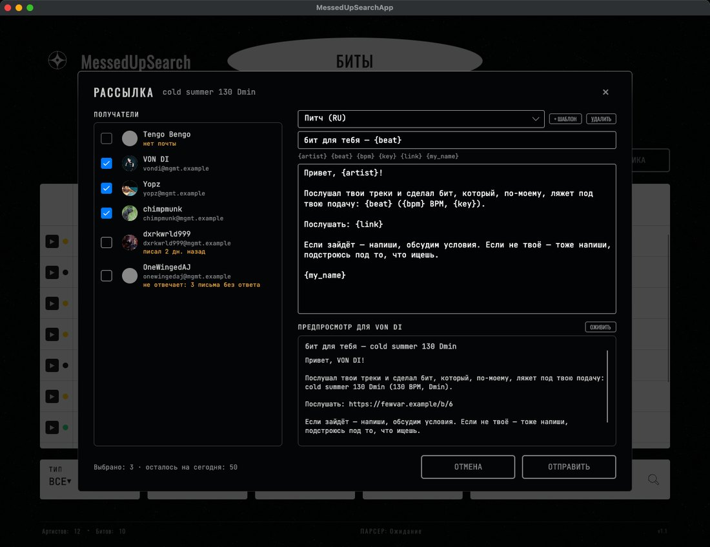
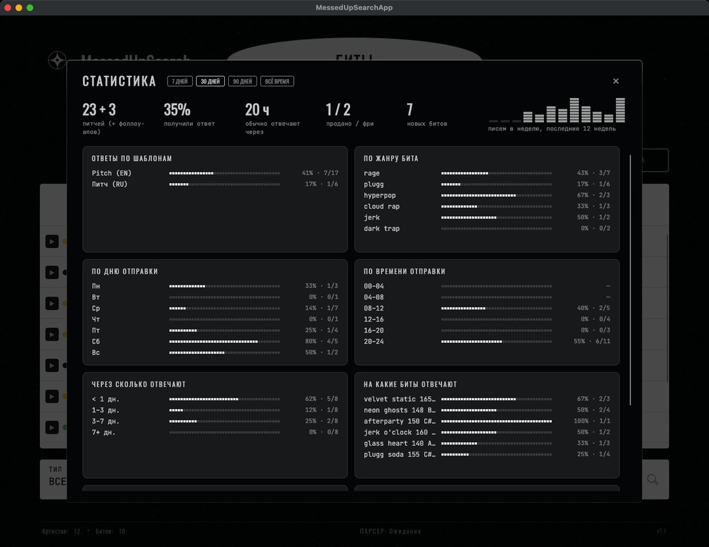
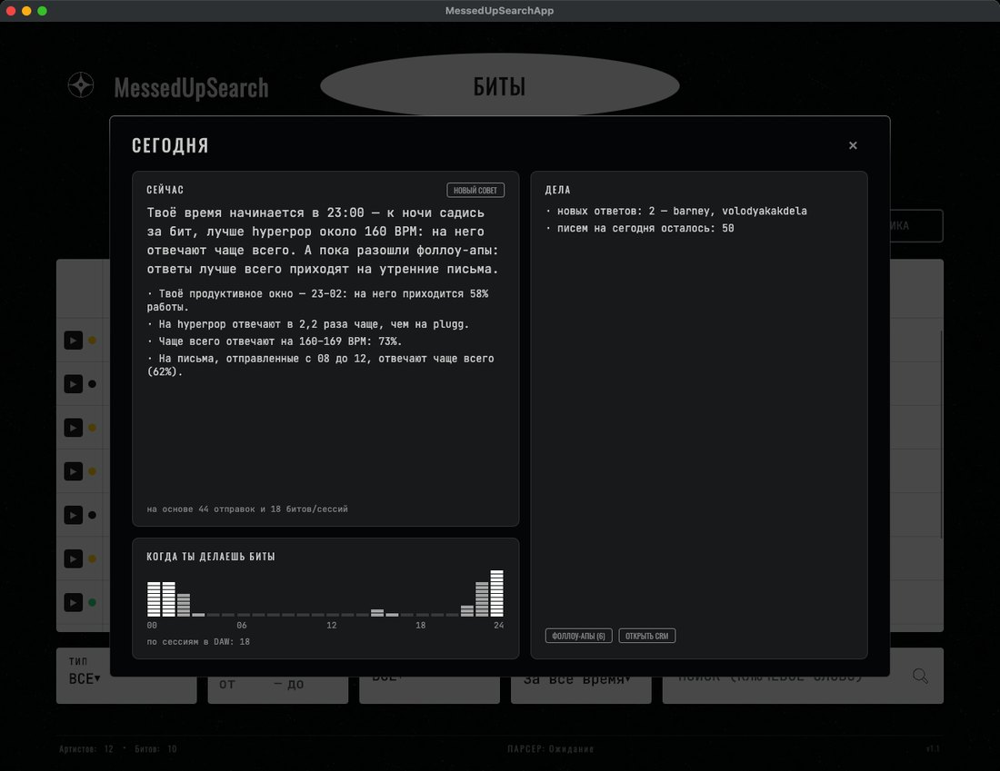

  

  <b>Русский</b> · <a href="README.en.md">English</a>

  
  
  
  

Приложение для битмейкера: все биты в одной таблице, база андеграунд-артистов, подбор артистов **по звучанию бита**, рассылка со своей почты и CRM, которая сама следит за ответами.

  <a href="https://github.com/fewvar/MessedUPSearch/releases/latest/download/MessedUpSearch.app.zip"><b>Скачать для macOS</b></a>
  &nbsp;·&nbsp;
  <a href="https://github.com/fewvar/MessedUPSearch/releases/latest/download/MessedUpSearch-win-x64.exe"><b>Скачать для Windows</b></a>

---

## Кому предложить бит

Открой бит, нажми **АНАЛИЗ** — через секунду приложение покажет:

- **«звучит как»** — трёх крупных артистов, на чей стиль похож бит;
- **кому предложить** — десять андеграунд-артистов (от 1 000 до 300 000 прослушиваний) из базы на 650+ рэперов с SoundCloud и Audius. У каждого: ▶ послушать тот его трек, что **ближе всего к твоему биту** — сразу слышно, почему он в списке; ＋ добавить к себе в базу; ↗ открыть профиль. Отметь подходящих галочками — и разошли бит им всем сразу.

Сравнивается именно звук: нейросеть слушает бит и сравнивает его с инструменталами треков артистов (голос из них вырезан заранее). Жанровые теги и BPM не нужны.

Это шорт-лист на прослушивание, а не готовая рассылка: послушай кандидатов по ▶ и выбери тех, кто реально в тему. На проверке нужный артист попадает в первую пятёрку среди 30 крупных примерно в половине случаев — это в три раза лучше случайного, но не магия.

Всё, что показал анализ, сохраняется: в карточке артиста видно, какие из твоих битов ему подходят.

## Биты и плеер

- Добавляй биты по одному (WAV / MP3) или импортируй целую папку — повторный импорт не создаёт дубликатов.
- Название, жанр, BPM, тональность и статус: **потенциал**, **фри** или **продан** (с типом лицензии).
- Фильтры по жанру, BPM, тональности, дате и поиск по названию — всё мгновенно. Клик по заголовку столбца сортирует: ▼ → ▲ → как было.
- Встроенный плеер с волной: ▶ в строке бита, перемотка кликом по волне, предыдущий / следующий бит, громкость запоминается. Пробел — пауза, ← / → — перемотка.

## Артисты и поиск новых

- База артистов: аватарка, ник, жанр, прослушивания, ссылки на SoundCloud, Instagram и Spotify, язык, заметки.
- ★ избранное и 🚩 ред-флаг — одним кликом прямо в таблице.
- **Парсер** ищет андеграунд-артистов сразу на пяти площадках — Audius, SoundCloud, Bandcamp, Last.fm, Jamendo: по жанру, числу прослушиваний, свежести релизов и стране. Соцсети подтягиваются с Genius. В базу попадают только те, кого ты отметил.

  
  

## Рассылка со своей почты

- Почта артиста, Telegram и другой контакт — в карточке. Кнопка «Найти в профиле» достаёт контакты из описания на SoundCloud и Audius (даже «name (at) gmail (dot) com») — в карточку они попадают только по твоему клику.
- **Разослать** бит можно прямо из его карточки или галочками из выдачи анализа. Письма уходят с твоего ящика (Gmail, Яндекс, Mail.ru, iCloud или любой другой), со ссылкой на бит, по одному раз в 20–40 секунд и не больше лимита в сутки — чтобы ящик не приняли за спамера. Рассылка идёт в фоне, окно можно закрыть.
- Шаблоны писем с подстановками (`{artist}`, `{beat}`, `{bpm}`, `{key}`, `{link}`, `{my_name}`) и предпросмотр на каждом артисте до отправки.
- Защита от спама: кому этот бит уже уходил, кому писал меньше недели назад и кто не отвечает на три письма подряд — сняты с галочки, с объяснением почему.
- **Оживить** — нейросеть по твоему ключу (Groq, OpenRouter или любой OpenAI-совместимый сервер) переписывает письмо под каждого артиста: его ник, жанр, один трек. Выдумывать факты ей запрещено, ссылка на бит проверяется — что не прошло проверку, уходит шаблоном.
- Пароль почты и ключ нейросети хранятся в системной связке ключей (Keychain / диспетчер учётных данных Windows), а не в файле настроек.

## Живая CRM

- Каждое письмо отмечается само: какой бит, кому, когда, каким шаблоном.
- Раз в несколько минут приложение смотрит входящие и находит ответы артистов — в CRM появляется «ответил» и первая строка ответа. Остальная почта не читается.
- Нет ответа неделю (срок настраивается) — **Фоллоу-апы** одной кнопкой: напоминание уходит в ту же переписку, одно на бит.
- Привязал бит вручную, но не отправил — приложение напомнит.
- Открытия писем не отслеживаются: для этого нужен свой сервер, а письма уходят напрямую с твоей почты.

## Статистика и «Сегодня»

- **Статистика** за неделю, месяц, три или всё время: процент ответов по шаблонам, жанрам битов, дням и часам отправки, через сколько отвечают, на какие биты отвечают чаще, какие артисты отвечают (жанр, прослушивания).
- **Сегодня** — подсказки на день, только про биты и отправки: в какое время ты обычно делаешь биты, на какой жанр и темп отвечают чаще, когда лучше рассылать, что лежит неотправленным и кому пора напомнить. С ключом нейросети — совет парой фраз; в неё уходят только эти цифры, без почт и имён.
- По желанию — учёт сессий в DAW (FL Studio, Ableton, Logic и другие): раз в минуту приложение смотрит, открыта ли DAW, и запоминает только интервалы вроде «FL Studio 14:05–16:40». Без заголовков окон и названий проектов, только на твоём компьютере, стирается одной кнопкой. Включается только с твоего согласия — и вместе с ним иконка в трее и запуск с системой, чтобы ответы и рассылка работали при закрытом окне.

  
  

На скриншотах — демо-данные: вымышленные письма и ответы, адреса в зарезервированном домене `.example`.

## Мелочи

- Русский и английский интерфейс, переключается сразу, без перезапуска.
- Плавные анимации по принципам Apple и несколько тихих звуков (анализ готов, бит отправлен, ★, парсер закончил) — и то и другое выключается в настройках; системное «Уменьшить движение» учитывается.
- Все данные хранятся локально на твоём компьютере. В сеть приложение ходит только за поиском артистов, их треками для плеера, один раз — за базой андеграунд-артистов, а ещё — в твою почту и к нейросети, если ты их подключил.
- Кнопка «Сообщить о проблеме» в настройках собирает письмо с версией и хвостом лога — отправляешь его сам из своей почтовой программы.

## Установка

**macOS** (Apple Silicon): скачай [`MessedUpSearch.app.zip`](https://github.com/fewvar/MessedUPSearch/releases/latest/download/MessedUpSearch.app.zip), распакуй и перетащи в «Программы». При первом запуске: правый клик → «Открыть» (приложение не подписано сертификатом Apple).

**Windows**: скачай [`MessedUpSearch-win-x64.exe`](https://github.com/fewvar/MessedUPSearch/releases/latest/download/MessedUpSearch-win-x64.exe) и запусти. Если SmartScreen предупредит о неизвестном издателе — «Подробнее» → «Выполнить в любом случае».

Для парсера Last.fm, Jamendo и Genius нужны бесплатные ключи — ссылки, где их взять, есть прямо в настройках.

---

Подбор по звуку работает на модели Discogs-EffNet (Essentia, MTG / Universitat Pompeu Fabra) под лицензией CC BY-NC-SA 4.0 — только некоммерческое использование. Сделано <a href="https://github.com/fewvar">@fewvar</a>.
