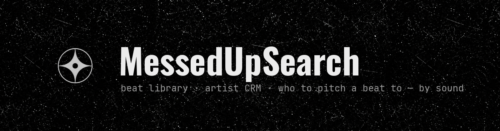
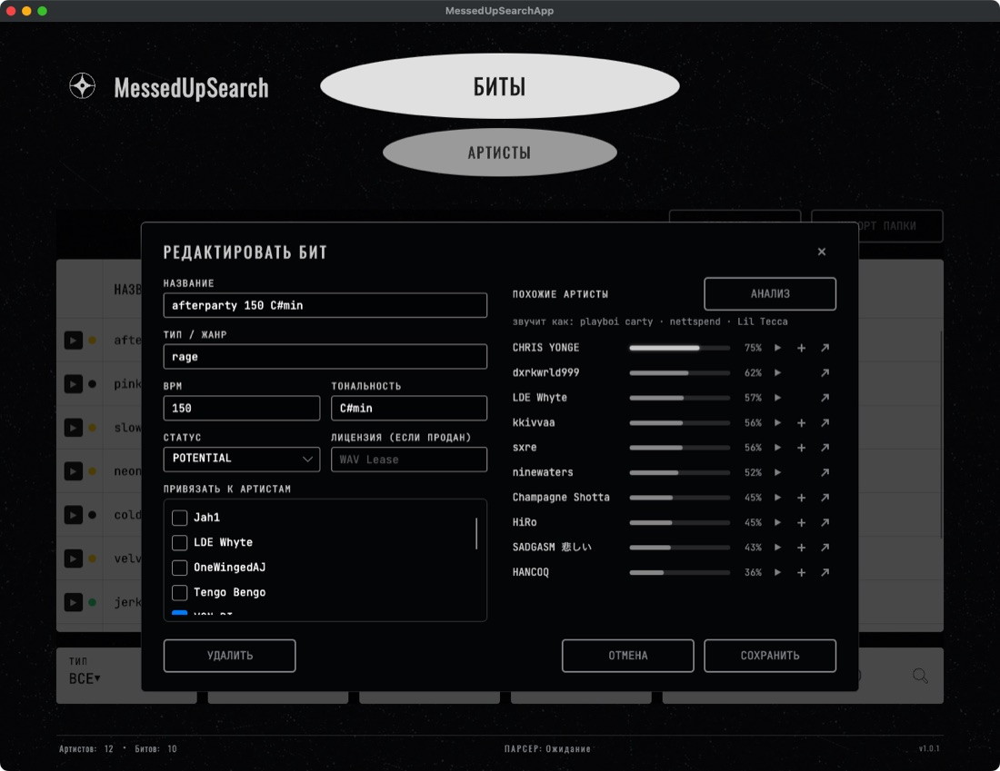
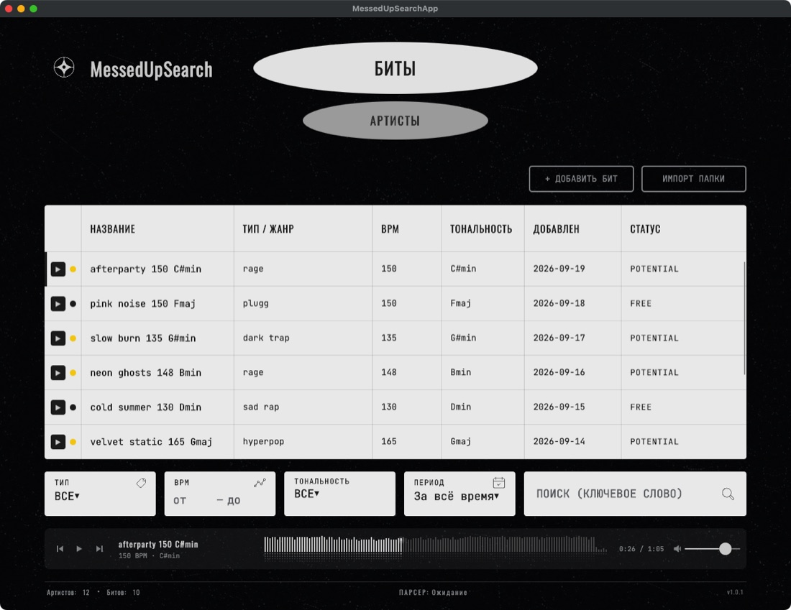
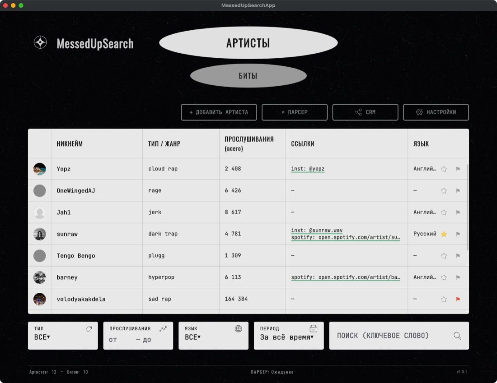
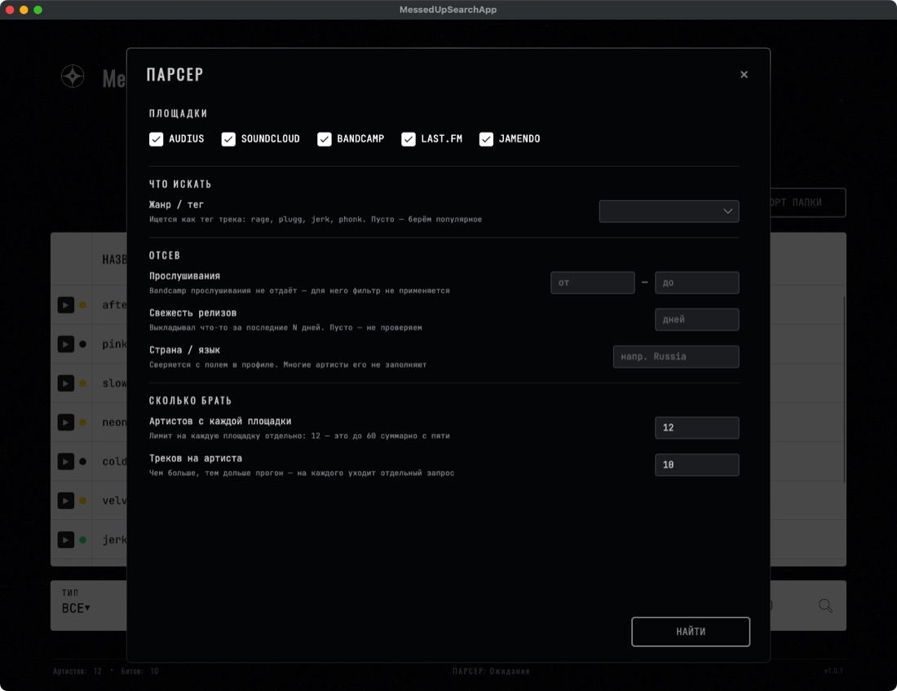
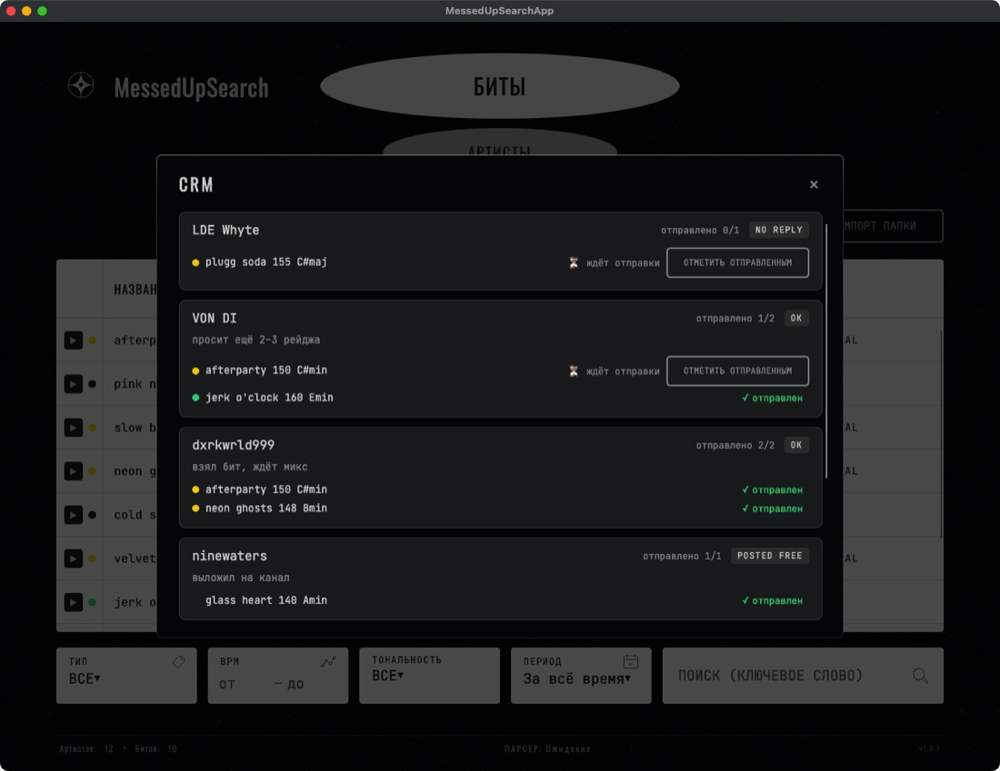
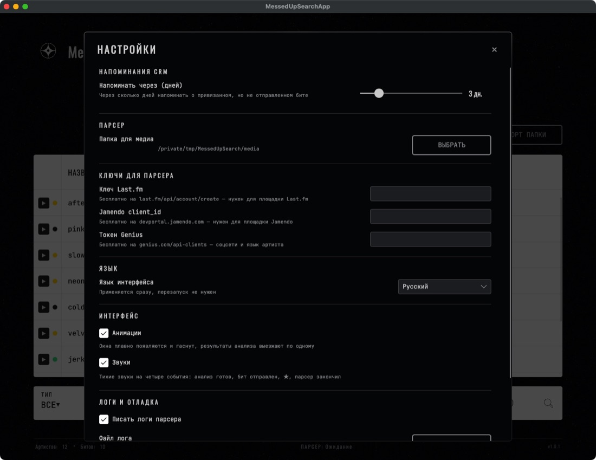

  

  <b>Русский</b> · <a href="README.en.md">English</a>

  
  
  
  

Приложение для битмейкера: все биты в одной таблице, база андеграунд-артистов, учёт того, кому что отправлено, — и подбор артистов, которым можно предложить бит, **по его звучанию**.

  <a href="https://github.com/fewvar/MessedUPSearch/releases/latest/download/MessedUpSearch.app.zip"><b>Скачать для macOS</b></a>
  &nbsp;·&nbsp;
  <a href="https://github.com/fewvar/MessedUPSearch/releases/latest/download/MessedUpSearch-win-x64.exe"><b>Скачать для Windows</b></a>

---

## Кому предложить бит

Открой бит, нажми **АНАЛИЗ** — через секунду приложение покажет:

- **«звучит как»** — трёх крупных артистов, на чей стиль похож бит;
- **кому предложить** — десять андеграунд-артистов (от 1 000 до 300 000 прослушиваний) из базы на 650+ рэперов с SoundCloud и Audius. У каждого: ▶ послушать тот его трек, что **ближе всего к твоему биту** — сразу слышно, почему он в списке; ＋ добавить к себе в базу; ↗ открыть профиль и написать.

Сравнивается именно звук: нейросеть слушает бит и сравнивает его с инструменталами треков артистов (голос из них вырезан заранее). Жанровые теги и BPM не нужны.

Это шорт-лист на прослушивание, а не готовая рассылка: послушай кандидатов по ▶ и выбери тех, кто реально в тему. На проверке нужный артист попадает в первую пятёрку среди 30 крупных примерно в половине случаев — это в три раза лучше случайного, но не магия.

Всё, что показал анализ, сохраняется: в карточке артиста видно, какие из твоих битов ему подходят.

## Биты и плеер

- Добавляй биты по одному (WAV / MP3) или импортируй целую папку — повторный импорт не создаёт дубликатов.
- Название, жанр, BPM, тональность и статус: **потенциал**, **фри** или **продан** (с типом лицензии).
- Фильтры по жанру, BPM, тональности, дате и поиск по названию — всё мгновенно. Клик по заголовку столбца сортирует: ▼ → ▲ → как было.
- Встроенный плеер с волной: ▶ в строке бита, перемотка кликом по волне, предыдущий / следующий бит, громкость запоминается. Пробел — пауза, ← / → — перемотка.

## Артисты и поиск новых

- База артистов: аватарка, ник, жанр, прослушивания, ссылки на SoundCloud, Instagram и Spotify, язык, заметки.
- ★ избранное и 🚩 ред-флаг — одним кликом прямо в таблице.
- **Парсер** ищет андеграунд-артистов сразу на пяти площадках — Audius, SoundCloud, Bandcamp, Last.fm, Jamendo: по жанру, числу прослушиваний, свежести релизов и стране. Соцсети подтягиваются с Genius. В базу попадают только те, кого ты отметил.

  
  

## Кому что отправлено

- Привязывай бит к одному или нескольким артистам прямо в карточке бита.
- **CRM** показывает всех, с кем идёт работа: статус (не ответил / ок / выложил фри), заметки, какие биты уже отправлены, а какие ждут.
- Привязал бит, но не отправил? Через заданное число дней приложение напомнит при запуске.

## Мелочи

- Русский и английский интерфейс, переключается сразу, без перезапуска.
- Плавные анимации по принципам Apple и несколько тихих звуков (анализ готов, бит отправлен, ★, парсер закончил) — и то и другое выключается в настройках; системное «Уменьшить движение» учитывается.
- Все данные хранятся локально на твоём компьютере. В сеть приложение ходит только за поиском артистов, их треками для плеера и один раз — за базой андеграунд-артистов.

## Установка

**macOS** (Apple Silicon): скачай [`MessedUpSearch.app.zip`](https://github.com/fewvar/MessedUPSearch/releases/latest/download/MessedUpSearch.app.zip), распакуй и перетащи в «Программы». При первом запуске: правый клик → «Открыть» (приложение не подписано сертификатом Apple).

**Windows**: скачай [`MessedUpSearch-win-x64.exe`](https://github.com/fewvar/MessedUPSearch/releases/latest/download/MessedUpSearch-win-x64.exe) и запусти. Если SmartScreen предупредит о неизвестном издателе — «Подробнее» → «Выполнить в любом случае».

Для парсера Last.fm, Jamendo и Genius нужны бесплатные ключи — ссылки, где их взять, есть прямо в настройках.

---

Подбор по звуку работает на модели Discogs-EffNet (Essentia, MTG / Universitat Pompeu Fabra) под лицензией CC BY-NC-SA 4.0 — только некоммерческое использование. Сделано <a href="https://github.com/fewvar">@fewvar</a>.
